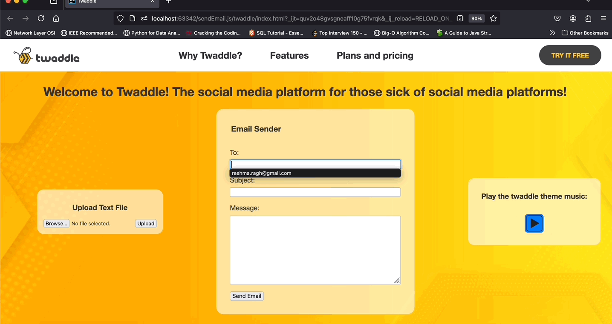

# twaddle

## Overview

Twaddle is a fun web app that utilizes Node.js functionality for uploading files, sending emails, and emitting events. This project demonstrates various features including file upload, email sending, and event handling within a simple HTML/CSS/JS web interface.

## Demo



## Features

- **File Upload:** Allows users to upload text files to the server
- **Email Sending:** Enables users to send emails directly from the web app
- **Event Emitting:** Includes a feature to play theme music using event emission

## Installation and Setup

### Prerequisites

- **Node.js** (version 14 or higher)
- **npm** Node Package Manager

Ensure you have Node.js and npm installed on your system. You can download them from the [Node.js official website](https://nodejs.org/en).

### Setting Up the Project

1. **Clone the repository:**

   ```sh
   git clone https://github.com/reshmar00/twaddle
   cd twaddle

2. **Install dependencies:**

   ```sh
    npm install

### Running the Project

1. **Start the server:**

   ```sh
   node server.js

3. **Open your browser and navigate to:**

   ```sh
    http://localhost:3000

## Usage

### File Upload
1. Locate the "Upload Text File" section on the left side of the page.
2. Click the "Browse" button to select a local .txt file to upload (ensure it's small).
3. Click the "Upload" button. You should see a browser dialog saying "File Uploaded!". Verify the upload by checking the uploads/ folder in your local repository.
   NOTE: If you encounter an "Error uploading file" dialog, ensure you're uploading an existing text file and that the server is running.

### Email Sending
1. Find the "Email Sender" section in the center of the page.
2. Enter the recipient email ID, subject line, and email body content.
3. Click "Send Email". You should see a browser dialog saying "Email Sent!". Verify by checking your recipient email's inbox or spam folder.

#### Note on Email Functionality

The email sending feature is implemented using Mailgun. Currently, this feature can only be verified by contacting the repository owner. If you need to test this functionality, please reach out to me at [reshma.ragh@gmail.com].

In the future, this feature will be fully configurable through GitHub Secrets for easier setup in cloned repositories.

### Play Theme Music
1. Navigate to the "Play the twaddle theme music" section on the right side of the page.
2. Use the play and pause buttons to control the theme music playback.
   

### Project Structure

- **twaddle/**
  - **index.html:** Main HTML file for the web app.
  - **node_modules/:** Directory containing Node.js modules.
  - **package-lock.json:** Automatically generated file for npm dependencies.
  - **package.json:** Contains metadata about the project and its dependencies.
  - **playSound.js:** Handles the play-pause functionality for the theme music.
  - **res/**
    - **pause-button.png:** Pause button image.
    - **play-button.png:** Play button image.
    - **twaddle-bg-1.jpg, twaddle-bg-2.jpg, twaddle-bg-3.jpg:** Background images.
    - **twaddle-logo.png, twaddle-logo-long.png:** Logo images.
  - **sendEmail.js:** Handles the email sending functionality.
  - **server.js:** Main server file with Node.js and Express setup.
  - **style.css:** CSS file for styling the web app.
  - **theme/**
    - **nwo-theme-cut.mp3:** Theme music.
  - **uploadFile.js:** Handles the file upload functionality.
  - **uploads/:** Directory where uploaded files are stored.

## Additional Information

### Handling Emails
The server uses the Mailgun API to send emails. Make sure to configure your Mailgun settings correctly in the server.js file.

### Handling File Uploads
Multer middleware is used for handling file uploads. Uploaded files are stored in the uploads/ directory.

### Handling Events
The server emits a play-pause event which is handled to play or pause the theme music.

### Note: The banner elements are not functional. They are included for aesthetic purposes only. Clicking on the logo or any text in the banner will not trigger any action.

### DISCLAIMER: Graphics used, including the logo, play/pause buttons, and background images, are sourced from Freepik. No original creations are used in the design. The theme music is a short clip from WWE, and all rights belong to them.

Feel free to reach out if you have any questions or need further assistance. Enjoy twaddling!
